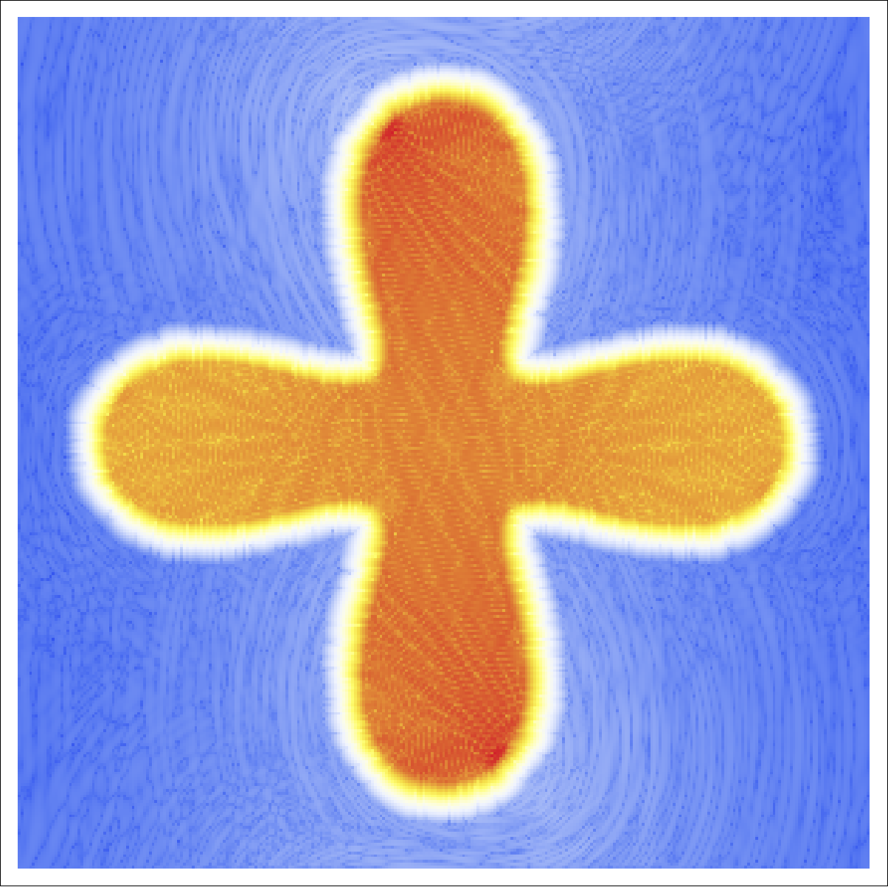

# CUDA Computational Electrodynamics Sample & Gallery

## Non Technical Summary

This is a code sample provided to demonstrate the author's ability to provide programming that is both high-performance and academically rigorous enough to be used in a scientific context.    It also specifically demonstrates the author's ability to generate novel implementations synthesized from multiple scientific papers.

It also includes a gallery that demonstrates an eye for visuals, like this totally gratuitous and very well anti-aliased visualization of a tachyon' shockwave:

 
As you can imagine, this sort of code is a complicated web that is generally difficult to produce without a litany of tiny bugs that result in wildly bad simulation results.  A gallery of these results is provided to demonstrate the author's ability to solve complex problems with creative methods:

## Technical Summary
Provided is an implementation of the [WCMOD7 algorithm](http://www.sciencedirect.com/science/article/pii/S0021999107002227) in CUDA 7 for use in a high-speed FDTD simulation on the `Yee Lattice`.  Specifically, this code is required to achieve O(n^2) accuracy because [proper sub-pixel materials anti-aliasing is non-trivial](https://dspace.mit.edu/handle/1721.1/49474) and results in anisotropic material boundaries.

Included is a graph demonstrating that the traditionally O(N\^2) complexity algorith results in O(N\^2) accuracy gains using this result against known solutions.  A couple of different kernels were tested, but each of them fell within expected parameters:

Finally, here's a visual comparison with output from a similarly rigorous CPU based algorithm, [meep](https://meep.readthedocs.io/en/latest/):

## Bonus Content:

#### Nanophotonics experiment design and simulation graphics:

#### Basic electrical engineering knowledge:

#### Assorted contextless nanophotonics graphs:

#### More Fun Blowups:

